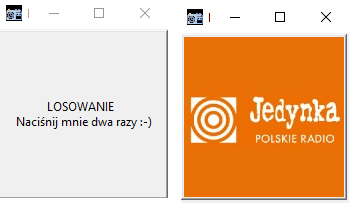

# RANDOM RADIO STATION SELECTOR

### Screenshot:
 

When you and your colleagues can't decide which radio station to listen to together, this little script for randomly selecting radio stations might be just what you need.  
Once a station is selected, you can listen to it, for example, on [radiofm-online.com](https://radiofm-online.com).

**How to use:**
- Click once on the picture to start the selection.
- Click again on the picture to stop the selection.

Radio station logos are the property of their respective owners.
